# Sample SysML v2 Project
## Purpose
The purpose of this repository is to share the sample SysML v2 source files.  
The sample project follows [SysML v2 2022-07](https://github.com/Systems-Modeling/SysML-v2-Release/tree/2022-07).
## Assumed Situation
### Who are you?
You are a systems engineer.  

You work in the system development company XXX and have to develop an Emergency Alert Control System (EACS), which issues alert when high impacts are detected. The system will be delivered to the customer in company YYY.

Your responsibility is to complete the followings.

- Identify stakeholder needs and concern and satisfy them
  - Model system requirements and system architecture to satisfy customer needs
  - Model system architecture and allocate its elements to software to satisfy software engineer needs
  - Model scenarios based on system architecture to satisfy verification engineer needs

The image of the stakeholder relationships is as below.

### What do you develop?
The sample system is Emergency Alert Control System (EACS).  

If the system detects strong impacts (i.e. high acceleration) at normal temperatures, the system issues an emergency alert. However, if the system detects high temperature, the system does not issue emergency alerts to prevent false alerts due to sensor failures.

The EACS consists of the following four components.

- Acceleration Sensor detects impacts of the system.
- Temperature Sensor measures the temperature of the system.
- Controller decides whether an emergency alert will be issued or not according to inputs from Acceleration Sensor and Temperature Sensor.

The image of the Emergency Alert Control System is as below.

## MBSE Processes
The MBSE processes in this example are as below.

| #   | Process                                                                             | 
| --- | ----------------------------------------------------------------------------------- | 
| 1   | [Stakeholder Definition](src/system-stakeholder.sysml)                              | 
| 2   | [Viewpoint and View Definition](src/system-viewpoint-and-view.sysml)                | 
| 3   | [System Requirement Definition](src/system-requirement.sysml)                       | 
| 4   | [System Context Definition](src/system-context.sysml)                               | 
| 5   | [System Use Case Definition](src/system-use-case.sysml)                             | 
| 6   | [System Item Definition](src/system-item.sysml)                                     | 
| 7   | [System Use Case Activity Definition](src/system-use-case-activity.sysml)           | 
| 8   | [System Logical Architecture Definition](src/system-logical-architecture-stm.sysml) | 
| 9   | [System State Machine Definition](src/system-logical-architecture-stm.sysml)        | 
| 10  | [System Scenario Definition](src/system-logical-architecture-sd.sysml)              | 
